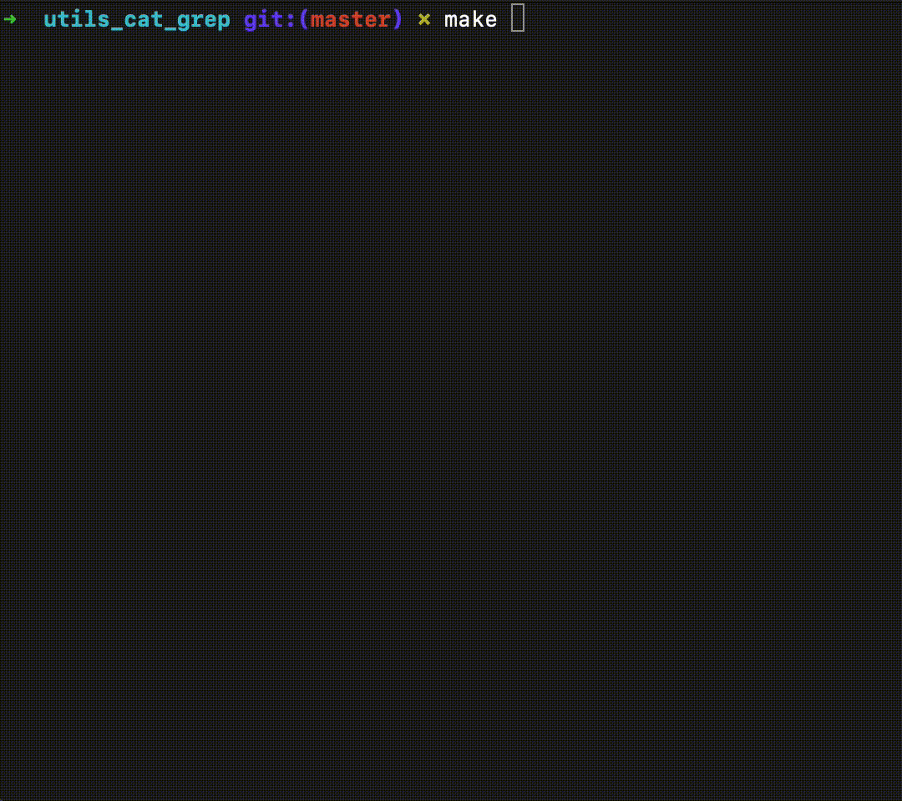
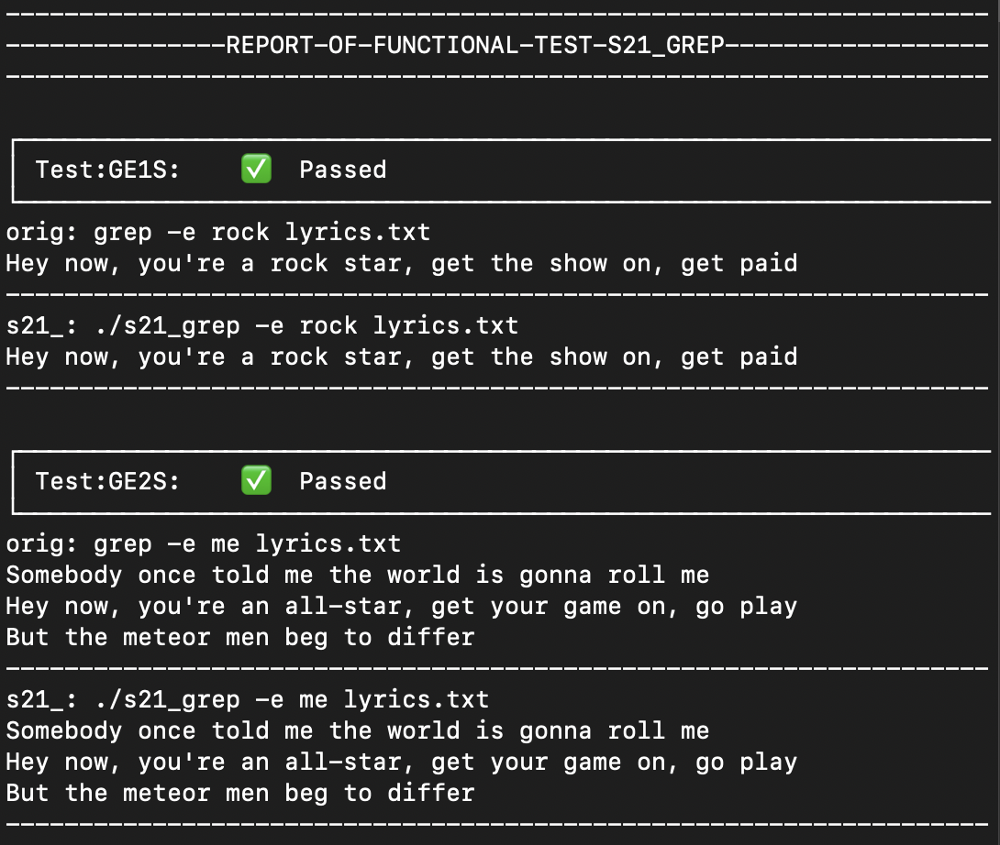

# utils_cat_grep

Development of command-line text utilities s21_cat and s21_grep implementing behavior of standart Bash utilities: cat, grep.
Support MacOS, Linux.

### Build
Make is used for building project. You can use

`make all`

to build both utilities or separate commands for each utility

`make s21_cat`  for s21_cat

`make s21_grep` for s21_grep

### Test
Functional tests is self-made by pair comparing behavior with original utils. The utils implement the MacOS behavior and they aren't work correctly in Linux. Please don't be afraid of some failed tests in Linux.

Run functional test with 

`make test`

### Test report
After test you can find diff report in /grep/logs/main_grep_report.txt, and for s21_cat too.

### s21_cat usage

Original 'cat' is one of the most frequently used commands on Unix-like operating systems. It has three related functions with regard to text files: displaying them, combining copies of them and creating new ones.

Run my s21_cat with following command:

`./s21_cat [option...] [file...]`

### s21_cat options 
>Support all combinations

| №   | Options                                                        | Description                                  |
|-----|----------------------------------------------------------------|----------------------------------------------|
| 1   | -b (GNU: --number-nonblank)                                    | numbers only non-empty lines                 |
| 2   | -e implies -v (GNU only: -E the same, but without implying -v) | but also display end-of-line characters as $ |
| 3   | -n (GNU: --number)                                             | number all output lines                      |
| 4   | -s (GNU: --squeeze-blank)                                      | squeeze multiple adjacent blank lines        |
| 5   | -t implies -v (GNU: -T the same, but without implying -v)      | but also display tabs as ^I                  |

### s21_grep usage

Original 'grep' searches the named input *file_name*'s for lines containing a match(es) to the given *template*

Run my s21_cat with following command:

`./s21_grep [options] template [file_name]`

**standart input is not supported*

### s21_grep options
>Support single and pair combinations

| №   | Options  | Description                                                    |
|-----|----------|----------------------------------------------------------------|
| 1   | -e       | pattern                                                        |
| 2   | -i       | Ignore uppercase vs. lowercase.                                |
| 3   | -v       | Invert match.                                                  |
| 4   | -c       | Output count of matching lines only.                           |
| 5   | -l       | Output matching files only.                                    |
| 6   | -n       | Precede each matching line with a line number.                 |
| 7   | -h       | Output matching lines without preceding them by file names.    |
| 8   | -s       | Suppress error messages about nonexistent or unreadable files. |
| 9   | -f  file | Take regexes from a file.                                      |
| 10  | -o       | Output the matched parts of a matching line.                   |
